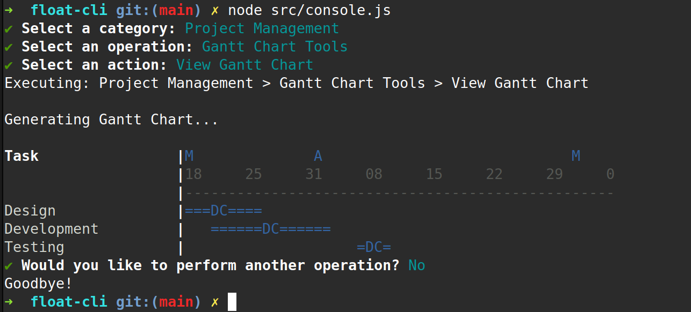

# Float-CLI

A fun little experiment in working with Float (float.com) data via the CLI


## Overview

This is a WIP and currently only shows a Gannt chart of all your project task allocations in Float.




## Features

- **Gannt Chart**: A visual view of your allocations similar to the Float UI.
- More to come


## Installation

### Manual Installation

```bash
# Clone the repository
git clone https://github.com/username/commandline-hero.git

# Navigate to the directory
cd commandline-hero

# Install dependencies
npm install

# Copy .env file and set API key
cp .env.example .env
vi .env

# Run it!
node --env-file=.env src/console.js


## Contributing

Contributions are welcome! Please feel free to submit a Pull Request.

1. Fork the repository
2. Create your feature branch (`git checkout -b feature/amazing-feature`)
3. Commit your changes (`git commit -m 'Add some amazing feature'`)
4. Push to the branch (`git push origin feature/amazing-feature`)
5. Open a Pull Request

## License

This project is licensed under the MIT License - see the [LICENSE](LICENSE) file for details.


## Acknowledgements

- [Commander.js](https://github.com/tj/commander.js)
- [Inquirer.js](https://github.com/SBoudrias/Inquirer.js)
- [Chalk](https://github.com/chalk/chalk)
- All our contributors and supporters!